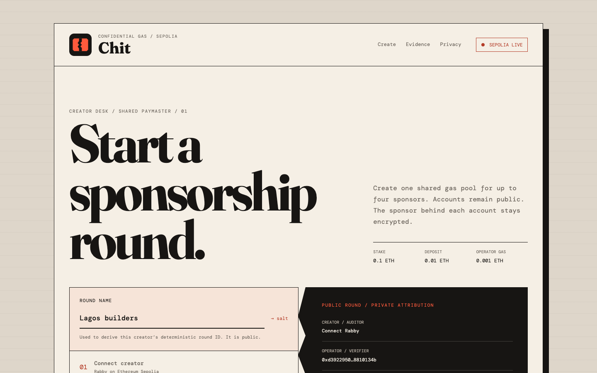
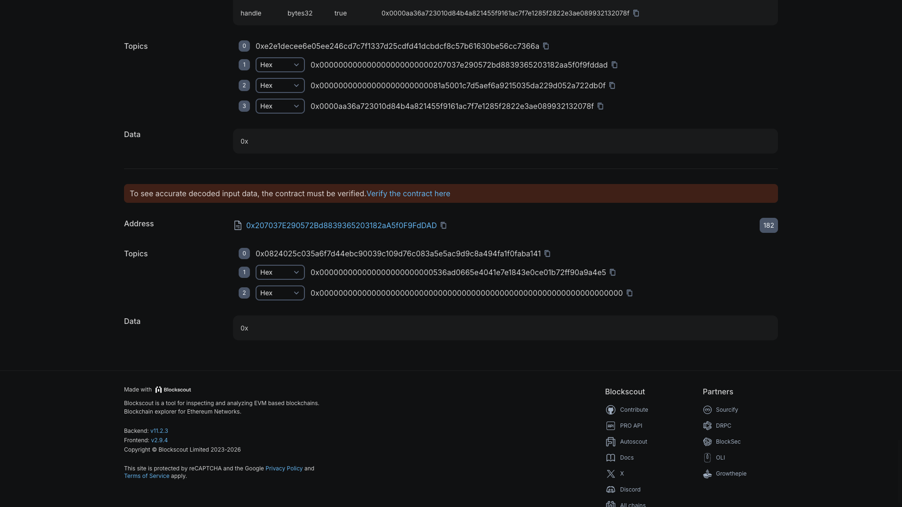
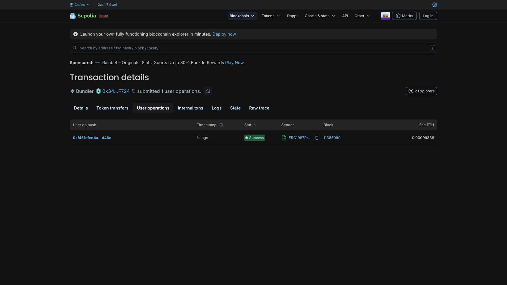
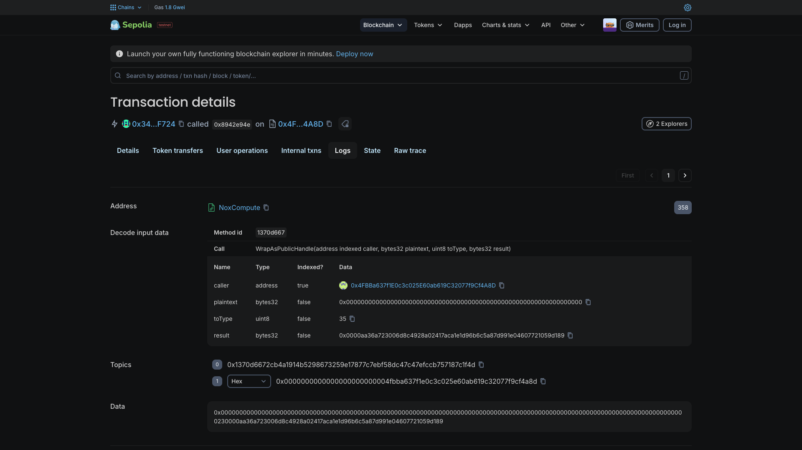

# Chit: confidential gas sponsorship attribution

Chit is a canonical ERC-4337 paymaster that privately attributes authorized gas sponsorship to sponsor budgets without exposing the sponsor-to-user relationship on-chain. It uses iExec Nox TEE computations for the confidential attribution and settlement path.

[](https://www.typescriptlang.org/)
[](https://soliditylang.org/)
[](https://sepolia.dev/)
[](#build-and-test)
[](LICENSE)



## Contents

- [What Chit does](#what-chit-does)
- [Live app](#live-app)
- [Judge quick start](#judge-quick-start)
- [Privacy boundary](#privacy-boundary)
- [How the Nox privacy layer works](#how-the-nox-privacy-layer-works)
- [Live Sepolia evidence](#live-sepolia-evidence)
- [Architecture](#architecture)
- [Smart contracts](#smart-contracts)
- [Operator service surface](#operator-service-surface)
- [Run the creator app](#run-the-creator-app)
- [Build and test](#build-and-test)
- [Limits and roadmap](#limits-and-roadmap)

## Live app

[Open the Chit creator app](https://chit-kohl.vercel.app). The hosted [Lagos builders UserOperation path](https://chit-kohl.vercel.app/user-operation.html) runs the fixed sponsored action with Rabby on Ethereum Sepolia. Creating and activating another round requires 0.111 Sepolia ETH plus transaction gas.

## Judge quick start

Start with the browser app's **Judge path** section. It is a no-wallet review path for the recorded proof deployment: open the sponsored UserOperation, encrypted settlement, Nox external-input import, and [`feedback.md`](feedback.md) directly from the live page.

| Review goal | Evidence |
|---|---|
| Confirm the canonical EntryPoint v0.7 UserOperation | [Sponsored UserOperation](https://eth-sepolia.blockscout.com/tx/0x0e5ddf0b032f284399cfe2ae3fbe8cf664ebc4c0a0e0acbdd56611d512f35970) |
| Confirm the creator-driven Lagos builders UserOperation | [Live hosted UserOperation](https://eth-sepolia.blockscout.com/tx/0x4585cd9e21ce2189bd77ee3edccaa020968068a714ce3507fe0df399a7c13176) |
| Confirm encrypted epoch settlement | [Encrypted settlement](https://eth-sepolia.blockscout.com/tx/0x99cd61e2ff3d6bdbca4bcb492a68a3d3891f7b9d42dea2242a8b2219a7e3996f) |
| Confirm contract-bound Nox input | [Budget import](https://eth-sepolia.blockscout.com/tx/0x8a23b9e81e8a9aec7738a6ef2fd717dfd31b399b4c0c880f3618f346c3f00036) |
| Review the iExec integration findings | [`feedback.md`](feedback.md) |

The creator flow and proof deployment are currently separate, and are labeled that way in the app. The creator flow creates a new round; it does not claim to reproduce the completed UserOperation and settlement without a hosted operator and a funded round.

## What Chit does

A normal paymaster leaves a public sponsor-to-user graph. Chit keeps the sponsored account public, as ERC-4337 requires, while storing its sponsor slot as an iExec Nox ciphertext handle.

The proof deployment records the following lifecycle on Ethereum Sepolia:

1. A sponsor imports an encrypted budget through `Nox.fromExternal`.
2. The operator enrolls an account against an encrypted sponsor slot.
3. A signed UserOperation lands through EntryPoint v0.7.
4. `postOp` records the public gas claim.
5. Epoch settlement attributes claims across four fixed sponsor slots on ciphertext.
6. The designated auditor can decrypt the round; another wallet is denied.

[Watch or download the two-minute demo](submission/demo.mp4).

## Privacy boundary

Chit does not claim that confidential budget limits work without a trusted party. The verifying operator checks sponsor solvency off-chain and knows the full sponsor graph. The contract keeps attribution private, but it does not remove that trust assumption.

| Boundary | Data |
|---|---|
| Public | sponsored addresses, funding amounts (`wrap` takes plaintext), per-user gas consumed, aggregate settled per epoch |
| Private | which sponsor backs which user, per-sponsor remaining budget, per-sponsor charge, the haircut |
| Trusted | the operator/verifying signer knows the full graph off-chain |

Sponsor participation is public. `SponsorRegistered` identifies the sponsor wallet and its slot. The private fact is which sponsored account was enrolled into that slot. Chit makes no anonymity-set claim; a round with two sponsors still has only two possible backers.

## How the Nox privacy layer works

Chit uses [`@iexec-nox/nox-protocol-contracts`](https://github.com/iExec-Nox/nox-protocol-contracts) and [`@iexec-nox/nox-confidential-contracts`](https://github.com/iExec-Nox/nox-confidential-contracts). NoxCompute validates external-input proofs, maintains ACLs for encrypted handles, and requests confidential operations from the Nox TEE network. Chit's contracts hold typed `euint256` handles. They never receive the underlying private values as ordinary Solidity integers.

### 1. A sponsor encrypts the budget for one vault

The sponsor browser asks the Nox gateway to encrypt a `uint256` for the exact `ChitVault` that will consume it. The result is an `externalEuint256` handle and a 137-byte proof. The proof is contract-bound: using it against another vault fails validation.

[`ChitVault.registerSponsor`](contracts/ChitVault.sol) imports the handle, gives the ERC-7984 wrapper one-call access, and moves the confidential token balance into the vault:

```solidity
euint256 budget = Nox.fromExternal(encryptedBudget, inputProof);
Nox.allowTransient(budget, address(wrapper));
_budget[slot] = wrapper.confidentialTransferFrom(
    msg.sender,
    address(this),
    budget
);
_grant(_budget[slot]);
```

The public chain sees the sponsor, assigned slot, wrapper transaction, and funding amount used to create confidential tokens. It does not receive the remaining budget as plaintext.

### 2. Enrollment stores an encrypted sponsor slot

The trusted operator separately encrypts the sponsor slot for `ChitSettlement`. Enrollment imports it with `Nox.fromExternal` and stores the resulting `euint256` under the sponsored account:

```solidity
_sponsorOf[account] = Nox.fromExternal(encryptedSlot, inputProof);
_grant(_sponsorOf[account]);
emit AccountEnrolled(account);
```

`AccountEnrolled` reveals the account but omits the slot. The sponsor-to-account edge exists only as a Nox handle on-chain and in the trusted operator's private policy store.

### 3. ERC-4337 records a public gas claim

EntryPoint calls [`ChitPaymaster.postOp`](contracts/ChitPaymaster.sol) after the sponsored UserOperation. Chit records the account's actual gas cost in a public epoch claim. No Nox work runs in `postOp`, which keeps the canonical paymaster hook simple and avoids pretending that ERC-4337 execution itself is private.

Paymaster validation is also a public `view` path. It checks eligibility and a verifier signature bound to the chain, EntryPoint, paymaster, UserOperation fields, maximum cost, and expiry. It cannot decrypt a sponsor budget or branch on an encrypted comparison. The verifier therefore checks confidential budget solvency off-chain and is a declared trusted party.

### 4. Settlement attributes every claim across four slots

After the epoch closes, the operator supplies the public accounts and claims. `ChitSettlement` checks each amount against the paymaster, rejects duplicates, and requires the supplied total to equal the public epoch total.

Attribution then runs the same four-slot Nox path for every account:

```solidity
for (uint256 slotIndex = 0; slotIndex < MAX_SPONSORS; slotIndex++) {
    ebool matches = Nox.eq(slot, Nox.toEuint256(slotIndex));
    euint256 amount = Nox.select(
        matches,
        claimValue,
        Nox.toEuint256(0)
    );
    totals[slotIndex] = Nox.add(totals[slotIndex], amount);
}
```

There is no early exit when a slot matches. Each account produces four encrypted comparisons, four encrypted selections, and four additions. The invariant execution shape avoids leaking the selected sponsor through control flow.

### 5. The haircut and debit stay confidential

For each slot, settlement computes the implemented pro-rata charge on Nox handles:

```text
charge[i] = slotClaims[i] * budget[i] / totalBudget
```

The Solidity path uses `Nox.safeMul`, `Nox.safeDiv`, and `Nox.safeSub`. The charge gets a transient ACL grant to the vault, which debits the encrypted sponsor balance. Neither the slot total, charge, nor remaining budget is converted to a public integer.

### 6. ACLs decide who can decrypt

Every Nox operation returns a fresh handle, so access does not carry over from its inputs. Both privacy contracts call `_grant` after producing a stored value:

```solidity
Nox.allowThis(value);
Nox.allow(value, auditor);
```

The vault also grants its settlement contract persistent access. `allowTransient` is reserved for one-call consumption by the ERC-7984 wrapper or vault. At the end of settlement, Chit calls `Nox.allowPublicDecryption` only on `_lastAggregate`. Per-sponsor charges and balances remain available to the designated auditor, while an unrelated wallet is denied.

### What the TEE does, and what it does not do

NoxCompute validates handle proofs and ACLs on Sepolia, then triggers the confidential operations executed by the Nox TEE network. Chit does not deploy a separate enclave or add its own remote-attestation scheme; it relies on Nox for that compute boundary.

The TEE protects computations over sponsor slots, budgets, charges, and balances. It does not hide ERC-4337 sender addresses, UserOperation calldata, gas usage, paymaster deposits, sponsor participation, or funding transactions. The trusted verifier still knows the private sponsor graph because it must enforce solvency before signing a UserOperation.

## Live Sepolia evidence

The records under [`deployments/`](deployments/) are the source for every address and transaction shown here or in the demo.

### Completed lifecycle

| Item | Address or transaction |
|---|---|
| Canonical EntryPoint v0.7 | [`0x0000000071727De22E5E9d8BAf0edAc6f37da032`](https://eth-sepolia.blockscout.com/address/0x0000000071727De22E5E9d8BAf0edAc6f37da032) |
| iExec NoxCompute | [`0x24Ef36Ec5b626D7DCD09a98F3083c2758F0F77bF`](https://eth-sepolia.blockscout.com/address/0x24Ef36Ec5b626D7DCD09a98F3083c2758F0F77bF) |
| Chit paymaster | [`0x57c7436bbbb40b08adef5c84f0aeaee0c4f3e011`](https://eth-sepolia.blockscout.com/address/0x57c7436bbbb40b08adef5c84f0aeaee0c4f3e011) |
| Chit vault | [`0xb2ceab244e3ef6a9a3440db7b723887296a14d4e`](https://eth-sepolia.blockscout.com/address/0xb2ceab244e3ef6a9a3440db7b723887296a14d4e) |
| Chit settlement | [`0x4fbba637f1e0c3c025e60ab619c32077f9cf4a8d`](https://eth-sepolia.blockscout.com/address/0x4fbba637f1e0c3c025e60ab619c32077f9cf4a8d) |
| Sponsored UserOperation | [`0x0e5ddf0b...2f35970`](https://eth-sepolia.blockscout.com/tx/0x0e5ddf0b032f284399cfe2ae3fbe8cf664ebc4c0a0e0acbdd56611d512f35970) |
| Encrypted epoch settlement | [`0x99cd61e2...7e3996f`](https://eth-sepolia.blockscout.com/tx/0x99cd61e2ff3d6bdbca4bcb492a68a3d3891f7b9d42dea2242a8b2219a7e3996f) |

### Nox proof and selective disclosure

[`deployments/phase0-live.json`](deployments/phase0-live.json) records the independent browser-to-contract Nox gate used before the full lifecycle:

| Check | Recorded result |
|---|---|
| External input transaction | [`0x8a23b9e8...6c3f00036`](https://eth-sepolia.blockscout.com/tx/0x8a23b9e81e8a9aec7738a6ef2fd717dfd31b399b4c0c880f3618f346c3f00036) |
| External-input proof | 137 bytes |
| Resolved Nox handle | `0x0000aa36...464ec81` |
| Designated auditor decrypt | passed |
| Unrelated wallet decrypt | denied |

The lifecycle record in [`deployments/sepolia.json`](deployments/sepolia.json) adds distinct encrypted input handles for sponsor budget and account enrollment, followed by the successful UserOperation and encrypted settlement transactions.

### Creator-driven low-stake round

The hosted Lagos builders round now has its own complete creator-driven ERC-4337 proof. Transaction [`0x4585cd9e...c13176`](https://eth-sepolia.blockscout.com/tx/0x4585cd9e21ce2189bd77ee3edccaa020968068a714ce3507fe0df399a7c13176) deployed canonical SimpleAccount `0x3671...633F`, executed the fixed counter increment, and emitted both a successful EntryPoint `UserOperationEvent` and Chit's `ChitRecorded`. The account nonce advanced to `1`, the counter advanced from `1` to `2`, and Chit recorded a `795401975725200` wei epoch claim. The machine-readable verification is in [`deployments/lagos-builders-user-operation.json`](deployments/lagos-builders-user-operation.json).

The frontend creates resumable rounds through factory `0xae9f63B7E7b0aC875AaDBEC56efCccFb88Ea87e6`. The recorded proof round uses paymaster `0x421afB0667Faf8B2Aa1d4e03EAb68c327875D54F`, a 0.1 Sepolia ETH stake, a 0.01 ETH deposit, and 0.001 ETH for operator gas.

The low-stake round proves public round creation and sponsor registration. The completed UserOperation and settlement above belong to the earlier proof deployment. The demo inserts a full-screen handoff before switching between them.

| Sponsor registration | UserOperation | Settlement |
|---|---|---|
|  |  |  |

## Architecture

```text
Creator wallet (Rabby)
  |
  +--> ChitRoundFactory
         +--> ChitVault       encrypted budgets, four fixed slots
         +--> ChitSettlement  encrypted attribution and haircut
         +--> ChitPaymaster   ERC-4337 validation, claims, stake

Sponsor browser
  |
  +--> iExec Nox gateway --> 137-byte external-input proof
  |                              |
  +--> ERC-7984 wrapper ---------+--> ChitVault.registerSponsor

Sponsored account --> EntryPoint v0.7 --> ChitPaymaster.postOp
                                              |
Public gas claim ------------------------------+
                                              v
Trusted operator --> fixed-path epoch settlement on Nox handles
                                              |
                                              +--> public aggregate
                                              +--> auditor-only attribution
```

The settlement loop always visits all four sponsor slots. It does not stop after finding the matching encrypted slot, because an early exit would leak attribution through execution shape.

## Smart contracts

| Contract | Responsibility |
|---|---|
| `ChitRoundFactory` | Derives deterministic round IDs, deploys the three round contracts, stages five Nox initialization writes, and activates the round. |
| `ChitPaymaster` | Implements the ERC-4337 paymaster hooks, verifies operator authorization, records public claims, and manages the EntryPoint deposit and stake. |
| `ChitVault` | Imports sponsor budgets, stores four encrypted balances, grants Nox ACLs, and returns remaining confidential balances after closure. |
| `ChitSettlement` | Stores encrypted sponsor slots, attributes public claims with a fixed path, applies the pro-rata haircut, and exposes only the aggregate for public decryption. |
| `ChitAssets` | Supplies the test ERC-20, ERC-7984 wrapper, and restricted counter used by the Sepolia proof. |

## Operator service surface

The production deployment now hosts narrow creator-signed enrollment and UserOperation paths for the Lagos builders round. [`/api/round`](https://chit-kohl.vercel.app/api/round) checks Neon and the live Sepolia roles; [`/enroll.html`](https://chit-kohl.vercel.app/enroll.html) obtains a creator signature before the protected operator imports a Nox-encrypted sponsor slot; and [`/user-operation.html`](https://chit-kohl.vercel.app/user-operation.html) permits only the fixed counter increment before self-bundling through EntryPoint. The generic routes below remain the broader library surface and are not all exposed publicly.

| Method | Route | Purpose |
|---|---|---|
| `GET` | `/health` | Reports RPC, gateway, operator, and bundler readiness. |
| `GET` | `/v1/rounds/:roundId` | Reads the public round snapshot. |
| `POST` | `/v1/operators/derive` | Returns the round-scoped public operator address. |
| `POST` | `/v1/rounds/:roundId/sponsors` | Stores creator-authorized sponsor policy after checking chain evidence. |
| `POST` | `/v1/rounds/:roundId/invites` | Issues an authenticated, encrypted, owner-bound invite. |
| `POST` | `/v1/rounds/:roundId/enroll` | Imports the encrypted sponsor slot and enrolls the account. |
| `POST` | `/v1/rounds/:roundId/user-operations/prepare` | Validates the restricted call and reserves exact prefund. |
| `POST` | `/v1/rounds/:roundId/user-operations/submit` | Verifies the user-signed envelope and self-bundles it. |
| `POST` | `/v1/rounds/:roundId/settle` | Reconstructs a closed epoch and submits settlement. |
| `POST` | `/v1/rounds/:roundId/operator-gas/recover` | Returns unused operator gas after closure. |

The hosted endpoint stores one-time challenges in Neon. `SERVICE_MASTER_SECRET` remains a Vercel production secret; the service derives the round-scoped operator in memory and rejects startup unless its public address matches all protected contract roles.

## Run the creator app

### Requirements

- Node.js 22 or newer
- npm 10 or newer
- Brave with Rabby Wallet enabled
- Ethereum Sepolia selected in Rabby
- 0.111 Sepolia ETH plus transaction gas to activate a new round

### Setup

```bash
git clone https://github.com/ajanaku1/chit.git
cd chit
npm ci
npm --prefix app ci
npm --prefix app run verify
python3 -m http.server 4173 --directory app/dist
```

Open `http://127.0.0.1:4173` in Brave.

### Create a round

1. Enter a public round name.
2. Click `Connect Rabby` and approve the Sepolia connection.
3. Review the derived round target. Change the name before broadcasting if needed.
4. Create the vault, settlement, and paymaster.
5. Approve the five bounded Nox initialization transactions.
6. Approve activation. Rabby sends 0.111 Sepolia ETH to the factory, split between stake, deposit, and operator gas.

The app saves a pending transaction hash before waiting for its receipt. Reloading resumes confirmation instead of broadcasting another write.

## Build and test

```bash
# Compile the contracts, service, scripts, and tests
npm run build

# Run 128 root tests, including fork and HTTP transport coverage
npm test

# Verify the standalone browser app (14 tests plus production build)
npm --prefix app run verify
```

Run the root and browser verification suites locally with `npm test` and `npm --prefix app run verify`.

Live deployment scripts need a funded Sepolia test key. Copy `.env.example` to `.env`, add the key yourself, and never commit it.

| Variable | Use |
|---|---|
| `SEPOLIA_RPC_URL` | Optional Sepolia RPC override for live scripts. |
| `FORK_RPC_URL` | Optional Sepolia fork RPC used by Hardhat tests. |
| `DEPLOYER_PRIVATE_KEY` | Testnet deployment and live transaction signing. |
| `SERVICE_MASTER_SECRET` | Round-scoped trusted operator key derivation and encrypted policy storage. |
| `CHIT_SERVICE_TARGET_PATH` | Optional deployment record selected by the service checker. |

## Project structure

```text
app/          one-screen creator frontend and its state-machine tests
contracts/    factory, paymaster, vault, settlement, and proof assets
deployments/  versioned Sepolia addresses, handles, and transaction hashes
docs/         architecture notes and submission screenshots
reports/      raw upstream issue notes and reproduction details
scripts/      live deployment, browser-gate, and service verification scripts
src/          operator policy, transport, chain readers, and live adapters
test/         unit, transport, policy, lifecycle, and Sepolia-fork tests
submission/   final judged demo video
```

## Limits and roadmap

- Sepolia only. Mainnet deployment has not been tested.
- The operator/verifying signer is trusted for confidential budget solvency.
- The build self-bundles through `handleOps`; it does not integrate a third-party bundler.
- Ring signatures, ZK membership proofs, and public per-sponsor bonds remain future work.
- The hosted service has managed secrets and durable challenge storage, but still needs production monitoring and broader multi-sponsor policy migration before mainnet use.

## Feedback and upstream report

[`feedback.md`](feedback.md) records the integration findings from the build. The ACL propagation issue has a public reproduction in [`reports/2026-07-30-nox-auditor-acl-403.md`](reports/2026-07-30-nox-auditor-acl-403.md) and is tracked upstream as [iExec-Nox/nox-handle-sdk#105](https://github.com/iExec-Nox/nox-handle-sdk/issues/105).

## License

MIT. See [LICENSE](LICENSE).
