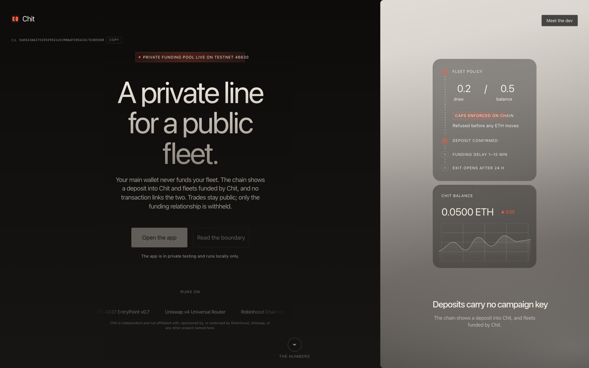

# Chit: a private funding layer for trading fleets

A trader who runs many wallets has to fund them. Doing that from one main wallet publishes the whole fleet on chain. Chit funds the fleet instead, so no transaction joins the trader's main wallet to a fleet account.

[](https://www.typescriptlang.org/)
[](https://soliditylang.org/)
[]()
[](#tests)
[](LICENSE)



## Live

**[chit.tools](https://chit.tools)**

Stage 1 is live on Robinhood Chain testnet 46630. Connect a wallet, create a five-account fleet, fund it, and run a sponsored buy through a real Uniswap v4 pool. The first sponsored buy landed on 6 September 2026.

New here? Read [ONBOARDING.md](ONBOARDING.md). It is the long version of this file: architecture, the rules, how to run everything, and where the work stands.

---

## What Chit does

A trading fleet is many wallets controlled by one trader. Each wallet needs gas to transact and principal to trade with. If both arrive from the trader's main wallet, anyone reading the chain can walk from that wallet to every account in the fleet.

Chit puts itself in the middle. The trader holds a balance with Chit, and Chit funds the fleet. The chain shows a deposit into Chit, and it shows fleets funded by Chit. No transaction links the two.

### What this is not

Gas sponsorship on its own does not hide a funding trail. To trade, a fleet wallet also needs principal, and principal sent from the main wallet recreates the link. This is the constraint the whole design is built around, and it is why the product ships in stages.

Chit is **private, not anonymous**. Accounts, trades, amounts, timing and gas all stay public. Only the funding relationship is withheld, and Chit's own operator can still see it. Chit never hides trades and never markets anonymity.

---

## Stages

| Stage | What it does | Status |
|---|---|---|
| **1. Private gas** | The operator pays the fleet's gas and settles it against the trader's ETH escrow. | Live on 46630 |
| **2. Private funding pool** | One shared, unkeyed pool funds gas and trade principal. The main wallet never funds the fleet; the operator can still link them, and while the pool is small, amounts and timing can too. | Built, gates green, live validation pending |
| **3. Trustless shielded pool** | A ZK pool where not even the operator can link a deposit to a fleet, with user-held view keys. | Not built |

Stage 1's honest claim is only that the operator pays your fleet's gas. Its escrow is a per-campaign deposit that names the owner on chain, so the link is still derivable from public events. Stage 2 replaces that escrow with a pool that carries no campaign identifier.

---

## How the pool works

The privacy property is one rule, enforced by the contract's shape:

> Deposits and spend are keyed by **depositor**. Draws and funding are keyed by **campaign**. No function and no event names both.

The depositor behind a draw travels on chain as a ciphertext that only the operator's ledger key opens. The contract cannot read it, so it cannot check that a posting names the right depositor. That is operator trust. It is disclosed in the product and auditable by anyone holding the ledger key.

Everything else is contract-enforced and refused before any ETH moves:

| Rule | Value |
|---|---|
| Deposit sizes | 0.01, 0.05, 0.1 ETH, fixed so one deposit looks like another |
| Per-trader balance cap | 0.5 ETH |
| Per-campaign draw cap | 0.2 ETH |
| Whole-pool cap | 5 ETH |
| Funding delay | 1 to 15 minutes, with a 60 second floor in the contract |
| Self-serve exit | 24 hours, works with the service offline |

Principal moves to a fleet account just in time for a buy and commits against the draw. A failed buy rolls it back. Spend posts against the depositor later, on its own timer and in coarse units, so the posted charge never carries the exact amount the campaign side recorded. The posting still follows the buy in the operator's next transaction; that adjacency is a join the contract does not yet break. Closing a campaign credits the unspent draw back to the balance rather than refunding a wallet, so closing publishes nothing.

---

## Architecture

```
Browser (app/)
  |  signed challenge over the page origin
  v
api/fleet/*.js  (Vercel functions, stateless)
  |
  v
src/fleet/service-runtime.ts     one router per warm instance, wired from env
  |
  +--> campaign-routes.ts        every action lands here
  |      |
  |      +--> chain-pool.ts      FleetPool reads and writes
  |      +--> pool-ledger.ts     seals and opens the depositor ciphertext
  |      +--> pool-buy.ts        just-in-time principal, sweep, settlement
  |
  v
Robinhood Chain testnet 46630
  |
  +--> FleetPool            custody, caps, draws, exit
  +--> FleetAccountFactory  deterministic fleet accounts
  +--> FleetSessionPolicy   the bounded session key
  +--> EntryPoint v0.7.0 -> Uniswap v4 Universal Router
```

There is no service database. Custody state lives on chain, so any function instance can serve any trader.

---

## Smart contracts

Deployed on Robinhood Chain testnet 46630. Addresses and every transaction hash are recorded in [deployments/fleet-46630.json](deployments/fleet-46630.json).

| Contract | Address | Role |
|---|---|---|
| `FleetPool` | `0xce92096098ae1e397b167292edad8f3bdb8200c9` | Stage 2 custody boundary: deposits, caps, draws, queued spend, exit |
| `FleetAccountFactory` | `0x5c0e2ec619c11b66e0e0efb7931bccfa6b784ea6` | Creates fleet accounts deterministically |
| `FleetSessionPolicy` | `0x57c7436bbbb40b08adef5c84f0aeaee0c4f3e011` | Bounds what a session key may do |
| `FleetCampaignEscrow` | `0xd2c31ec466ead5f745bc6ba08cc49ff8435f1325` | Stage 1 escrow, superseded by the pool |
| `FleetVenueToken` | `0x13283ab8e1f2bc4297e9ec6480c80c59674af554` | FLEET test token |

---

## Testing the app

You need a wallet and testnet ETH on Robinhood Chain 46630.

1. Add the network to your wallet. Chain id `46630`, RPC `https://rpc.testnet.chain.robinhood.com`.
2. Fund the wallet with testnet ETH.
3. Open [chit.tools](https://chit.tools) and connect.
4. Go to Balance and deposit a fixed size. The deposit is one transaction to the pool and carries no campaign identifier.
5. Create a fleet: pick a size, download the recovery vault, confirm it. Credentials are generated in your browser and encrypted locally. Chit never holds fleet keys.
6. Activate with a draw. The app shows "Funding your fleet" with the delay range and a countdown. The wait is deliberate: it is what stops a deposit and its fleet funding pairing by timing.
7. Run the permitted buy. Principal moves just in time and the swap lands through the Uniswap v4 router.
8. Watch the Control Room, then pause, revoke, or close. Closing returns the unspent draw to your balance.
9. Withdraw to an address you sign for, or use the 24 hour contract exit with Chit offline.

---

## Running locally

```bash
git clone https://github.com/Chit-org/chit-fleet.git
cd chit-fleet
npm ci && npm --prefix app ci
cp .env.example .env      # then fill in a testnet key
npm run dev:local         # http://localhost:3000
```

`dev:local` builds, assembles the site, and serves the landing, the app and the real API handlers on one origin. These are the same handlers Vercel runs, so no Vercel account is needed. The pool address comes from the recorded deployment, so a local run cannot drift from what is deployed.

The only required secret is a testnet operator signer. Without it, `fund` and `buy` answer 503 rather than substituting a default.

---

## Tests

```bash
npm test              # 145 service tests
npm run test:fleet    # 133 fleet tests
npm --prefix app run verify   # typecheck, 111 browser tests, app build
./verify.sh           # every done predicate
```

`verify.sh` has the final vote. Done means it exits 0, and nothing else counts. Never weaken a check to make it pass.

Gates run in families. `pool-foundation` proves the contract, ledger and ABI separation on a 46630 fork. `pool-balance`, `pool-fund` and `pool-control` cover the journey. `pool-acceptance` replays a full journey and asserts that an observer scanning pool, factory and policy events cannot join the depositing wallet to any fleet account, then checks every Stage 1 gate is still green.

---

## Project structure

```
contracts/fleet/   FleetPool, account factory, session policy, escrow, test venue
src/fleet/         Operator service: routing, pool, ledger, settlement, SDK
api/fleet/         Vercel function entry points
app/               Browser app: wizard, Balance page, Control Room
landing/           Marketing site at the root of chit.tools
scripts/           Deploy and journey runners, local dev server, site assembly
test/              Service tests and 46630 fork tests
specs/             Spec, plan, data model and tasks per stage
deployments/       Recorded addresses and transaction hashes
```

---

## Status

Stage 1 is live and stays green. Stage 2 is built, every gate passes, and the pool is deployed. What remains is the live end-to-end validation on chit.tools.

Testnet and test token today. Next is a capped beta on Robinhood Chain mainnet, opened before the firm audit, not after it: holders only, the pool capped at 1 ETH, a guardian that can pause it, and the caps kept until a professional audit is complete. The contracts have not been audited by a firm. Chit's operator key can move what is in the pool, up to that cap.

---

## License

MIT
