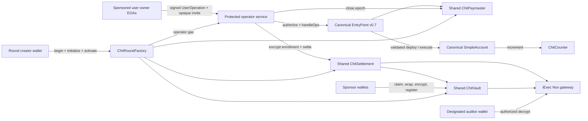

# Public sponsorship rounds

Status: **proposed, not implemented or deployed**

This document defines the smallest extension that lets a public wallet create a new Chit
sponsorship round without weakening Chit's shipped claim:

> A canonical ERC-4337 paymaster that privately attributes authorized gas sponsorship to sponsor
> budgets without exposing the sponsor-to-user relationship on-chain.

The existing Sepolia deployment remains the evidence for the original one-round journey. Public
round creation requires new contracts, a new Sepolia deployment, a protected operator service, and
a revised frontend. Nothing below is a claim about the current deployment.

## Decision

A round is a **shared multi-sponsor privacy pool**, never a paymaster owned by one sponsor.

- One round has one shared paymaster, one shared vault, and one shared settlement contract.
- Each round supports exactly four sponsor slots and always executes the four-slot Nox path.
- At least two sponsor slots must be registered before the paymaster authorizes an operation.
- The creator chooses an auditor once. The auditor cannot be changed after creation.
- The creator controls round policy through wallet-signed requests.
- The creator is the on-chain round administrator and can pause the round or rotate a compromised
  operator/verifier. Those actions are public.
- Privileged transactions and paymaster authorizations are executed by a protected, round-scoped
  operator key derived inside the Chit operator service. That key never reaches the browser.
- Every round stakes its paymaster through canonical EntryPoint v0.7 before activation, enabling the
  read-only external storage access used during validation under ERC-7562 staked-entity rules.
- Deployment and Nox initialization are staged so no creation transaction performs all encrypted
  zero-handle operations.
- A closed round returns the remaining confidential balance to each recorded sponsor, the unused
  EntryPoint deposit and delayed stake only to the recorded creator, and unused operator gas through
  a creator-authorized service recovery.
- The delegated operator/verifying service is explicitly trusted and knows the sponsor-to-user
  graph off-chain. The creator controls policy and is trusted with administrative visibility.
- Mainnet, arbitrary dapp calls, trustless sponsor authorization, and third-party bundlers remain
  out of scope.

A separate paymaster per sponsor is forbidden. EntryPoint exposes the paymaster for every
UserOperation, and paymaster ownership/deployment is public, so that design would recreate the
sponsor-to-user edge Chit exists to hide.

## Existing deployment versus proposed extension

| Concern | Existing Sepolia deployment | Proposed public-round extension |
|---|---|---|
| Rounds | One manually deployed instance | Factory creates discoverable round instances |
| Sponsors | Four slots, one currently funded | Exactly four slots per round; activation requires two registered slots |
| Collateral | Fixed supply minted to deployer | Existing token allocation funds a Sepolia-only claim-once faucet |
| Administrator | Deployer EOA | Round creator wallet |
| Operator | Deployer EOA | Protected round-scoped service key delegated and rotatable by creator |
| Verifier | Deployer EOA | Same protected round-scoped service key, independently rotatable |
| Bundling | Deployer calls `handleOps` | Service self-bundles; no third-party bundler |
| Enrollment | Owner-only deployment script | Opaque invite capability plus operator-only service transaction |
| Settlement | Owner-only deployment script | Creator-authorized, operator-only service transaction |
| Auditor | Constructor-selected deployer | Constructor-selected wallet supplied by creator |
| Frontend | Replay-only proposals | One progressive create/fund/enroll/sponsor/settle/audit/recover docket |

## Public, private, and trusted boundary

| | |
|---|---|
| Public | round creator, operator, verifier, and auditor addresses; round contracts; sponsor participation and funding amounts; sponsored SimpleAccounts and their owner EOAs; per-user gas consumed; paymaster deposits; aggregate settled per epoch |
| Private | which sponsor backs which user; per-sponsor remaining budget; per-sponsor charge; haircut; opaque invite capabilities |
| Trusted | delegated operator/verifying service knows the sponsor-to-user graph and declared budgets, tracks solvency off-chain, and enforces sponsorship policy; round creator controls policy and may have administrative visibility |

This does not promise sponsor anonymity. A round with two registered slots has two possible sponsors,
but Chit makes no quantitative anonymity-set claim. It promises that the chain does not publish the
mapping from sponsored account to sponsor slot.

## System shape

## On-chain additions

### `ChitRoundFactory`

The factory uses ordinary `new` deployments; no proxy, clone library, or new package is needed.
Round creation is staged:

1. `beginRound` rejects a zero creator, operator, verifier, or auditor and a reused creator salt. It
   deploys the vault, settlement, and paymaster without performing Nox operations, gives each core
   contract the creator administrator and immutable deploying factory, completes one-shot
   vault-to-settlement and settlement-to-paymaster wiring, records `Initializing`, and emits
   `RoundCreated`.
2. `initializeRoundStep(roundId, step)` is permissionless and retryable after a reverted
   transaction, but each successful step is one-shot. Steps `0..3` initialize the corresponding
   vault budget and settlement charge handles to encrypted zero with their ACLs. Step `4`
   initializes the settlement aggregate handle. The factory emits `RoundStepInitialized`.
3. `activateRound` is creator-only and requires all five initialization steps. It rejects a zero
   paymaster deposit, stake, unstake delay, or operator-gas amount and requires `msg.value` to equal
   their sum. Through factory-only paymaster initialization it deposits the declared gas balance,
   requires stake and delay at or above the documented Sepolia reference-bundler minimums, calls
   EntryPoint v0.7 `addStake(unstakeDelay)` with the declared stake, funds the protected operator
   address, calls the paymaster's one-shot activation, and emits `RoundActivated`.

Only `Active` rounds accept sponsor registration, enrollment, or paymaster authorization. An
`Initializing` round can be cancelled by its creator; because activation is the first payable step
and sponsor registration is inactive before it, cancellation has no protocol-held funds to recover.

The creator calls the factory directly, so creation consent and payment are wallet-authenticated.
The registry is discovery metadata, not a source of private attribution. Lifecycle reads are derived
from the paymaster's authoritative state rather than a separately mutable factory status.

Each factory stage is estimated on a Sepolia fork before broadcast. No stage may exceed 50% of the
latest Sepolia block gas limit. A slot step performs at most two Nox zero-handle operations and the
aggregate step performs one. If contract deployment itself or any single Nox operation exceeds that
ceiling, implementation stops for a revised design rather than raising an arbitrary gas limit.

### Core-contract changes

The encrypted arithmetic is not redesigned.

- `ChitVault` keeps `MAX_SPONSORS = 4` and its existing public `registerSponsor`.
- Registration additionally requires a short-lived creator signature bound to Sepolia chain ID,
  vault, sponsor address, and expiry. This prevents an unaffiliated wallet from filling the four
  slots. Sponsor participation is already public, so the admission adds no private relationship.
- The vault tracks registered sponsor addresses and rejects a second slot for the same address.
  Activation therefore means at least two distinct registered sponsor wallets, without claiming
  that distinct addresses prove independent real-world parties.
- `ChitVault` emits `SponsorRegistered(address indexed sponsor, uint256 indexed slot)`. Sponsor
  participation and slot allocation are public; only the encrypted user-to-slot mapping is private.
- `ChitSettlement` adds a public `enrolled(address)` boolean and rejects reassignment. It emits
  `AccountEnrolled(address indexed account)` without a slot. Settlement rejects any claim input for
  an account that is not enrolled, so an uninitialized encrypted slot can never default into slot
  zero attribution.
- `ChitSettlement.settleEpoch` accepts the closed paymaster epoch, requires it to equal the next
  unsettled epoch, and marks it settled before any external vault debit. A recovered service request
  therefore cannot charge the same epoch twice.
- Settlement is bound to its one-shot paymaster, rejects duplicate or unenrolled account entries,
  checks every supplied claim against `paymaster.claim(epoch, account)`, and requires their sum to
  equal `paymaster.epochTotal(epoch)`. The operator cannot omit, duplicate, or alter a public claim
  while producing encrypted attribution.
- The current single `owner` role is split: immutable creator administration can pause and rotate;
  the mutable operator performs enrollment and settlement. A paused round rejects both.
- `_attributeClaims` always loops over all four slots. No active-count shortcut or early exit is
  allowed.
- `ChitPaymaster` is bound to its round vault and settlement. It rejects authorization while fewer
  than two sponsor slots are registered or when `userOp.sender` is not publicly marked enrolled by
  that settlement.
- The paymaster separates creator administration from operator and verifier roles. The creator can
  pause and rotate either delegated role; the operator closes epochs; the verifier signs
  authorizations. A paused paymaster returns signature failure and cannot open new sponsorship.
- The authorization digest continues to bind chain ID, EntryPoint, paymaster, sender, nonce,
  calldata, gas fields, maximum cost, and expiry.
- Auditor ACL is re-granted after every Nox operation exactly as in the current contracts.
- The paymaster exposes creator-only wrappers around EntryPoint v0.7 `withdrawTo`, `unlockStake`,
  and `withdrawStake`. Recipients are fixed to the recorded creator; callers cannot supply an
  arbitrary withdrawal address.

The fixed four-slot loop is a privacy mechanism and a product limit. The UI displays `n / 4`
capacity before every sponsor registration; the contract remains the final enforcement.

### Closure and fund recovery

The paymaster owns the authoritative lifecycle: `Initializing`, `Active`, `Closing`, `Closed`.

1. The creator requests closure. The service first reconciles every pending authorization and
   reservation; the contract then pauses new authorization, closes the final epoch, and enters
   `Closing`.
2. The operator settles every outstanding epoch in order. If the service key is unavailable, the
   creator pauses and rotates the delegated operator before continuing.
3. `finalizeClose` is creator-only and requires the settlement's next epoch to equal the paymaster's
   current epoch. It marks `Closed` before any recovery call.
4. After `Closed`, each recorded sponsor calls `refundSponsor`. The vault marks that slot refunded
   before external interaction, grants the wrapper transient access to the remaining encrypted
   handle, confidentially transfers the balance only to the recorded sponsor, replaces the slot
   with a fresh encrypted zero, and re-grants ACL. A sponsor may later use the wrapper's normal
   unwrap/finalize flow, accepting that final unwrapping makes the amount public.
5. After `Closed`, the creator calls `withdrawDeposit`; the paymaster reads its remaining EntryPoint
   deposit and withdraws all of it only to the creator.
6. The creator calls `unlockStake`, waits the EntryPoint-recorded delay, then calls
   `withdrawStake`; the full stake is sent only to the creator. Closing never bypasses the canonical
   delay.
7. A creator-signed service request returns unused ETH from the round-scoped operator EOA to the
   creator, retaining only the gas needed for that recovery transaction. The service independently
   reads `Closed`, rejects any unresolved operation, fixes the recipient to the registry creator,
   and exposes no arbitrary sweep destination.

Refunds are pull-based and per-slot, so one unavailable sponsor cannot block creator deposit or
stake recovery. Sponsor refunds cannot occur before all epochs are settled. Repeated refund,
deposit-withdrawal, stake-unlock, and stake-withdrawal calls are rejected or are harmless reads of
zero canonical balances. No recovery path can redirect another party's assets.

### ERC-7562 validation compatibility

The paymaster validation path reads `sponsorCount` from the vault and `enrolled(sender)` from the
settlement. ERC-7562 permits a staked entity read-only access to storage in non-entity contracts
under rule `STO-033`; activation therefore requires the paymaster stake and delay described above.

Self-bundled `handleOps` remains the shipped and demonstrated path. Before the UI labels a round
compatible with a third-party canonical mempool, the exact deployed paymaster and first-operation
SimpleAccount factory path must pass the reference bundler's ERC-7562 tracer and gas estimation
using the configured minimum stake and delay. Different bundlers may impose higher policy
thresholds. Failure disables that compatibility label but does not weaken the self-bundled path.
No third-party bundler submission is added to this MVP.

Standards basis: [ERC-7562 storage rules](https://eips.ethereum.org/EIPS/eip-7562) and the canonical
[EntryPoint v0.7 stake/deposit interface](https://raw.githubusercontent.com/eth-infinitism/account-abstraction/v0.7.0/contracts/interfaces/IStakeManager.sol).

### `ChitFaucet`

The existing `ChitToken` remains fixed-supply. A new Sepolia-only faucet is funded by transferring
part of the deployer's existing allocation into it.

- Each address may claim one fixed test-collateral allocation.
- Claim amount and claimant are public.
- Sybil resistance is explicitly not provided on Sepolia.
- The faucet cannot mint.
- The frontend then performs the existing public sequence: claim, approve wrapper, wrap to cCHIT,
  authorize the round vault as wrapper operator, encrypt the budget for that vault, and call
  `registerSponsor`.

The wrap and funding amount remain public, matching the existing disclosure. The sponsor's remaining
budget and eventual charge remain ciphertext.

## Protected operator service

The service is required for asynchronous public use. A factory alone cannot produce the verifier
signature required by `validatePaymasterUserOp`, submit operator-only enrollment or settlement
calls, or self-bundle a UserOperation.

### Key boundary

- A master derivation secret and bundler key live only in the deployment platform's secret store.
  The service derives separate domain-bound keys for round operators and invite-token AEAD.
- The service derives a round-scoped secp256k1 operator key from the master secret, Sepolia chain ID,
  factory address, creator address, and creator-selected 32-byte salt.
- The derived address is supplied to the factory before creation and recorded in `RoundCreated`.
- A leaked derived key affects one round and can be stopped by the creator's pause/rotation path;
  compromise of the master secret affects every managed round and is an explicitly documented
  testnet risk.
- The factory funds the derived address with the declared operator-gas amount.
- No endpoint returns a private key, raw signature oracle, master material, or unrestricted
  transaction relay.
- No operator, bundler, invite, or RPC secret is placed in browser JavaScript, committed files,
  logs, screenshots, or demo output.

The round creator remains the policy authority. Privileged service requests carry a short-lived
wallet signature from the recorded creator. Each signature binds the app origin, chain ID, factory,
round, request body hash, nonce, and expiry. The service is the delegated executor and verifying
signer.

### Opaque invite capability

A creator first signs a sponsor-admission link for an exact sponsor wallet. After that wallet uses
the link to register a slot, the sponsor registers its private policy record with the service and
then requests an invite for one owner EOA. The service verifies the sponsor's wallet signature,
`SponsorRegistered` event, and confirmed public wrapper funding, then returns an authenticated
encrypted token containing:

- version, Sepolia chain ID, factory and round ID;
- sponsor slot;
- owner EOA and its exact deterministic round-scoped SimpleAccount address;
- expiry and nonce; and
- permitted demo action.

The token is sent to the user off-chain. It is never submitted to a contract or logged. The service
decrypts it, computes the expected SimpleAccount from the canonical v0.7 `SimpleAccountFactory`,
the owner EOA, and
`uint256(keccak256(abi.encode("CHIT_ACCOUNT_V1", chainId, round, ownerEOA)))` as its salt, creates
a Nox external encrypted sponsor-slot input bound to the round settlement contract, and submits
operator-only enrollment for that predicted account. The plaintext slot never appears in calldata
or an event. User signatures are still required from the owner EOA for the SimpleAccount
UserOperation. The public `enrolled` flag prevents a second invite from reassigning an account to
another encrypted slot.

### Private policy store

The verifier cannot enforce per-sponsor solvency from ciphertext on-chain. It therefore maintains
the private graph required by `Goal.md`: round, sponsor, slot, owner EOA, SimpleAccount, declared
initial budget, public claims attributed to that slot, remaining policy allowance, and invite status.

- The sponsor sends the declared budget to the trusted service over TLS while independently creating
  the Nox ciphertext in-browser.
- The service verifies the public wrap and registration receipts, but does not claim those receipts
  prove the encrypted value equals the declaration.
- Records are encrypted at the application layer with AES-GCM from Node's built-in `crypto`; the
  encryption key lives in the platform secret store.
- The encrypted records are persisted with Node 22's built-in SQLite support on a durable volume, so
  no npm dependency is introduced.
- A unique key on `(round, SimpleAccount)` prevents graph reassignment; unique operation keys prevent
  duplicate authorization and settlement records.
- The service rejects a declaration larger than the sponsor's confirmed cumulative public wrapper
  funding for the demo asset. This is only a public upper bound; the service still cannot prove the
  sponsor transferred the declared amount into the encrypted vault slot.
- Before signing, one atomic policy-store transaction reserves the operation's maximum cost against
  the sponsor allowance. Concurrent requests therefore cannot each spend the same remaining
  allowance.
- After a confirmed `ChitRecorded` receipt, the service replaces the reservation with the actual
  public claim. A known failed bundle releases it; an unknown RPC outcome retains it until the
  operation key is reconciled against EntryPoint and paymaster state. Settlement is blocked while a
  round has unresolved reservations.
- The service refuses an authorization whose maximum cost exceeds unreserved sponsor allowance.

This is trusted enforcement, not a cryptographic proof that the private database matches the
ciphertext. That limitation is reproduced in the UI and README.

The MVP permits only one `ChitCounter.increment()` operation per account per epoch, with a fixed
maximum cost and short authorization expiry. The service checks the current account nonce, public
enrollment, and that the paymaster claim for the account in the current epoch is still zero.
Concurrent authorizations share the same account nonce, so EntryPoint can land at most one.
Arbitrary target calls are a later policy feature, not part of public rounds.

### Sponsored account path

The invited wallet is the owner EOA; the enrolled and sponsored address is its deterministic
round-scoped SimpleAccount.

- Both browser and service derive the same salt and call the canonical v0.7 factory's `getAddress`.
- The invite is bound to both the owner EOA and predicted account. The owner signs invite acceptance.
- If the account has no code, the prepare endpoint accepts only the exact `initCode` for canonical
  `SimpleAccountFactory.createAccount(ownerEOA, salt)`—represented as the exact v0.7
  `factory`/`factoryData` pair before packing—and requires `userOp.sender` to equal the predicted
  address.
- If the account already has code, `initCode` must be empty and the service verifies the account's
  public owner is the invited EOA.
- The call data must be the exact SimpleAccount execution of the round's fixed
  `ChitCounter.increment()` with zero value.
- The browser inserts the returned paymaster data and the owner EOA signs the complete operation
  using the SimpleAccount signing convention. EntryPoint deploys the account during the first
  sponsored operation when needed.

This makes the address in `AccountEnrolled`, `ChitRecorded`, the paymaster `claim` mapping, and
settlement input the same SimpleAccount address. The owner EOA and counterfactual deployment are
public; the sponsor slot remains encrypted.

### API surface

| Endpoint | Caller proof | Result |
|---|---|---|
| `POST /v1/operators/derive` | creator address + round salt | derived public operator address only |
| `GET /v1/rounds/:id` | none | public registry and live-chain status |
| `POST /v1/rounds/:id/sponsors` | registered sponsor wallet signature | encrypted-at-rest policy record for the declared budget |
| `POST /v1/rounds/:id/invites` | sponsor wallet signature | opaque owner-and-account-bound invite token |
| `POST /v1/rounds/:id/enroll` | opaque token + owner EOA signature | enrollment transaction hash |
| `POST /v1/rounds/:id/user-operations/prepare` | opaque token + unsigned operation envelope | exact paymaster data, reservation ID, and expiry |
| `POST /v1/rounds/:id/user-operations/submit` | reservation ID + fully user-signed prepared operation | `handleOps` transaction hash |
| `POST /v1/rounds/:id/settle` | creator wallet signature | close and settlement transaction hashes |
| `POST /v1/rounds/:id/operator-gas/recover` | creator wallet signature | recovery transaction hash and retained gas |

Every mutation carries a deterministic operation key. Sponsor policy registration uses
`(round, sponsor, registration transaction)`, invite creation uses `(round, sponsor, owner EOA,
invite nonce)`, enrollment uses `(round, SimpleAccount)`, sponsorship uses the final canonical
UserOperation hash, and settlement uses `(round, epoch)`. Creator, sponsor, and user
request-signature nonces are single-use. Operator-gas recovery uses `(round, closed block hash)` and
reconciles the operator balance before every sweep. Before resubmission after an RPC timeout, the
service looks up the corresponding event or on-chain state; it never blindly sends a duplicate.
Request IDs exist for tracing but are not treated as durable state.

The prepare endpoint validates the exact round, chain, EntryPoint, paymaster, sender, nonce,
`initCode`, SimpleAccount owner, call target and selector, gas ceilings, maximum cost, and expiry;
atomically reserves that maximum cost; and returns the exact paymaster data containing the verifier
authorization. The browser inserts that data and the user signs the complete canonical
UserOperation. The submit endpoint accepts only a byte-for-byte match to the reserved fields,
verifies the account signature by EntryPoint simulation, and self-bundles `handleOps` using the
bundler address as beneficiary. The service never receives or signs the user's account key. Expired
unused preparations release their reservations only after confirming that their canonical operation
hash did not land.

### Settlement source

At epoch close, the service obtains users and claims from the round paymaster's public
`ChitRecorded` events and `claim` mapping. It calls `closeEpoch`, then supplies the closed epoch ID
and its public user/claim arrays to `settleEpoch`. The settlement contract accepts each epoch once
and uses its encrypted enrollment mapping for constant-path attribution; no sponsor slot appears in
the settlement request.

### Service security and operations

- Strict CORS allowlist for the deployed app origin.
- Per-IP, per-wallet, and per-round rate limits.
- Request-body size limits and schema validation.
- Short request deadlines, bounded read retries with jitter, and no automatic write retries.
- Structured logs contain request ID, round ID, public tx hash, duration, and outcome only.
- Invite tokens, sponsor slots, decrypted graph data, handles not already public, signatures, and
  secrets are redacted.
- Health checks cover RPC, Nox gateway, operator balance, and bundler balance.
- Alerts cover authorization rejection spikes, low operator balance, repeated failed bundles, and
  settlement failures.

The factory registry and events remain the public source of truth. The encrypted policy store holds
only the explicitly trusted graph and solvency state that cannot be reconstructed publicly without
destroying Chit's privacy claim.

## Browser Nox gate

Sponsor budgets must be encrypted in the sponsor's browser and bound to the new vault address. The
trusted verifier receives the separately declared budget policy needed for off-chain enforcement,
but it never creates the on-chain ciphertext on the sponsor's behalf.

Before contract implementation starts, a dedicated spike must prove in a production browser build:

1. the already-installed Nox client can create a real 137-byte external-input proof for a
   factory-created vault;
2. the sponsor wallet can approve, wrap, set the vault operator, and register the encrypted budget;
3. the resulting handle resolves at the live testnet gateway; and
4. the designated auditor can decrypt while a non-auditor is denied.

Failure of this browser spike is a stop-and-report blocker. It cannot be worked around by having the
service encrypt and import the sponsor's on-chain budget.

## One-screen Option A journey

The Settlement Docket is one route and one primary action at a time. Its state is derived from
wallet, registry, receipts, and contract reads rather than demo flags.

1. **Create** — connect creator wallet; enter immutable auditor address, paymaster deposit, stake,
   unstake delay, operator gas, and random round salt; acknowledge the trusted operator and
   four-sponsor limit; deploy, complete the five visible initialization steps, and activate.
2. **Fund** — creator signs an address-bound sponsor link; that sponsor claims test collateral,
   approves, wraps, grants the vault operator, encrypts a budget in-browser, registers, and signs
   the separate declared-budget policy request. The docket shows `n / 4`; activation waits for at
   least two registered slots.
3. **Enroll** — sponsor enters one owner EOA and signs an invite request; the user opens the opaque
   link, connects that EOA, signs acceptance, and the service derives and submits encrypted
   enrollment for its deterministic round-scoped SimpleAccount.
4. **Sponsor** — the service validates the restricted counter operation and returns the exact
   paymaster authorization; the user signs the complete prepared UserOperation; the service verifies
   that immutable envelope and self-bundles it through canonical EntryPoint v0.7.
5. **Settle** — creator signs a close request; the service closes the epoch, reconstructs public
   claims from events, and submits constant-path encrypted settlement.
6. **Audit** — the immutable auditor connects and decrypts the round handles. A non-auditor wallet
   receives and displays the real gateway denial.
7. **Recover** — the creator closes the final epoch and waits for settlement; sponsors pull their
   remaining confidential balances; the creator withdraws the paymaster deposit, begins the
   canonical stake delay, later withdraws the stake, and requests unused operator-gas recovery.

Each state shows pending, confirmed, and recoverable failure variants. Etherscan links expose every
public transaction. The blind-seam motif continuously separates the public evidence column from the
encrypted attribution column.

## Failure handling

| Failure | User-facing recovery |
|---|---|
| Wrong network | Switch to Sepolia; no transaction is prepared |
| Factory transaction rejected | Return to Create with values preserved |
| Initialization step exceeds gas ceiling | Stop activation and report the measured step; do not fund the round |
| Faucet already claimed | Continue with existing balance |
| Nox proof generation fails | Retry gateway; never submit plaintext |
| Round has four sponsors | Show capacity reached; create another shared round |
| Fewer than two registered sponsors | Keep round in Funding; paymaster authorization remains unavailable |
| Invite invalid, expired, or wrong wallet | Sponsor issues a new user-bound invite |
| Operator unavailable | Preserve signed user operation until expiry, then request a fresh one |
| RPC outcome unknown | Look up the deterministic operation key and transaction before offering retry |
| UserOperation simulation fails | Show the exact policy/gas failure; do not broadcast |
| Settlement fails | Preserve the closed epoch inputs and allow idempotent resubmission |
| Auditor denied | State that the connected wallet lacks viewer ACL; do not reveal fallback data |
| Sponsor refund unavailable | Leave that slot's ciphertext in the vault; other recovery remains available |
| Stake still locked | Display EntryPoint's exact withdrawal timestamp; do not offer an early path |

## Threat decisions

| Threat | Decision |
|---|---|
| Per-sponsor paymaster fingerprint | Forbidden; all sponsors in a round share one paymaster |
| One-sponsor inference | Paymaster inactive until two slots are registered; no anonymity-set claim |
| Sponsor-slot griefing | Creator-signed, address-bound, expiring registration admission |
| Operator key in browser | Forbidden |
| Generic signature oracle | Forbidden; service reconstructs and validates the complete digest |
| Derived-key compromise | Round-scoped blast radius; master compromise remains disclosed risk |
| Compromised delegated operator | Creator pauses and rotates operator/verifier on-chain |
| Invite theft | Token is authenticated, encrypted, user-bound, action-bound, and expiring |
| Sponsor reassignment | Public one-time `enrolled` flag rejects overwrite |
| EOA/account ambiguity | Invite binds owner and predicted account; claims and enrollment use only the account |
| Malicious account deployment | First operation permits only canonical factory, exact owner/salt, and predicted sender |
| Uninitialized slot attribution | Paymaster and settlement reject any unenrolled account |
| Early-exit attribution leak | Four-slot Nox loop is invariant |
| Service learns graph | Explicitly trusted and disclosed |
| Service learns declared budget | Explicit trusted boundary required for off-chain solvency; encrypted at rest and never logged |
| Public funding amount | Deliberately public and disclosed |
| Creator redirects sponsor refund | Impossible; vault recipient is the recorded sponsor |
| Sponsor blocks creator recovery | Impossible; refunds are independent of deposit and stake recovery |
| Premature recovery | Closed state requires every epoch settled |
| ERC-7562 external reads | Paymaster is staked before activation; compatibility is tracer-verified |
| Factory/Nox gas exhaustion | Five bounded initialization transactions with a 50%-of-block ceiling |
| Mainnet use | Unsupported |

## Implementation and verification order

1. Browser Nox encryption/decryption spike. Stop if it fails.
2. Failing staged-factory, one-shot initialization, activation value-split, capacity,
   duplicate-sponsor, role-wiring, enrollment-lock, unenrolled-claim, stake, lifecycle, recovery
   recipient, premature-withdrawal, and minimum-sponsor tests.
3. Factory/faucet and minimal core changes; measure every deployment step on a Sepolia fork, run the
   ERC-7562 tracer, then perform Solidity security review and simplification.
4. Failing service and policy-store tests for tampered sponsor admission or invite, a declaration
   above confirmed public funding, concurrent allowance reservations, unknown receipt outcomes, wrong
   owner/account/round/chain/paymaster/call, malicious or unexpected `initCode`, excessive gas or
   cost, expiry, a second operation in one epoch, duplicate request, encrypted-record corruption,
   and generic-sign attempts.
5. Protected service implementation with no new npm dependency; reuse Node and the installed viem
   and Nox packages.
6. Revised Option A states backed by contract reads and service responses, including initialization,
   closure, delayed stake withdrawal, confidential sponsor refund, and error states.
7. New Sepolia deployment; land one staged factory-created and staked round with at least two
   sponsors, a real browser-created Nox proof, one sponsored UserOperation, settlement, auditor
   decrypt, non-auditor denial, confidential sponsor refund, deposit withdrawal, stake
   unlock/withdrawal after its delay, and operator-gas recovery.
8. Record every address, role, ciphertext handle, and transaction hash without secrets.
9. Run the complete suite, deterministic RPC verification, privacy-boundary cross-check, Phase 3
   verifier, and independent fresh-context checker.

No existing successful deployment evidence is overwritten. Any replaced address is preserved as a
superseded deployment with an explicit reason.
